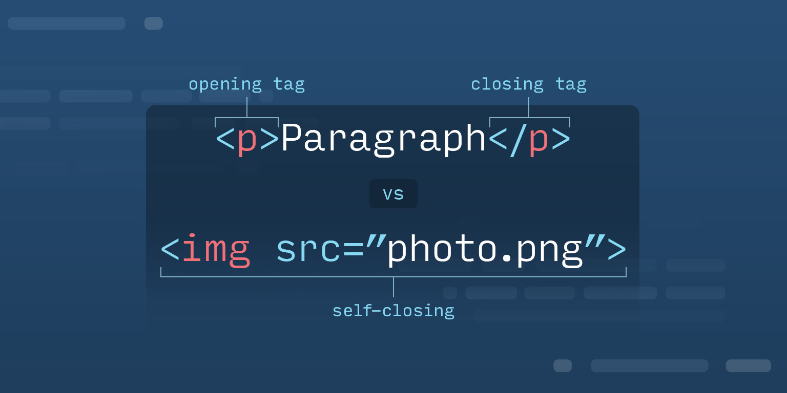
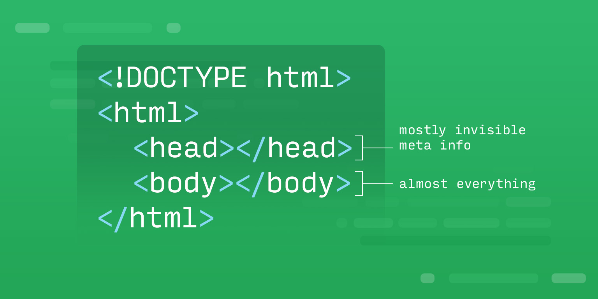
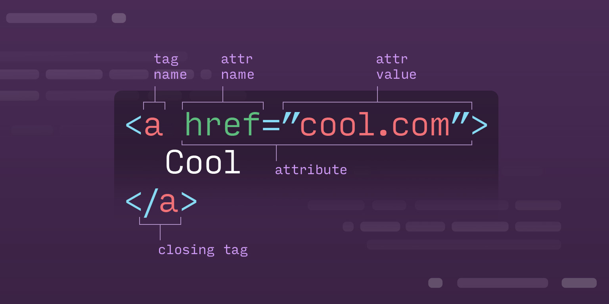
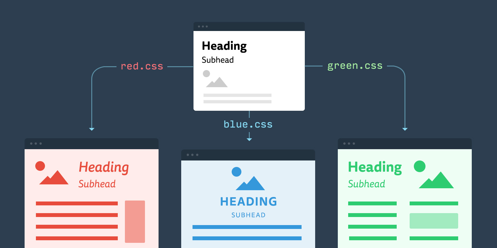
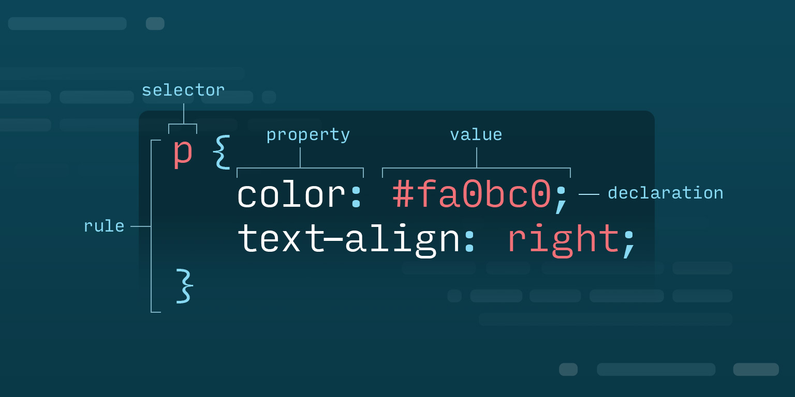

## Welcome to Foundations: Front-end Engineering ##

Each day you'll have study notes like this that will include helpful notes, examples, and resources needed to make the most of this course. Today's class will cover setting up your computer and introduce important HTML and CSS concepts.

## Today's Learning Objectives

Today we'll cover these learning objectives. By the end of today, you'll be able to

* define the term “semantics”
* apply the proper semantic (or non-semantic) tag to a content element
* use tag and class selectors to apply styles to HTML content
* identify the appropriate use of tag and class selectors for styling content

*As you attend the lecture and lab, read these notes, and work on your homework, keep these learning objectives top of mind. If you're having difficulty with any of the objectives, make sure to ask questions!*

## Computer Setup

You'll need to install two important tools:

* Google Chrome - a popular browser with excellent developer tools built in
* Atom - a free, open-source code editor built by GitHub
<!-- GitHub Desktop - a well-designed application for managing projects that are version-controlled with Git -->
You'll also need to sign up for a free GitHub account. Signing up for GitHub and installing these two tools should only take a few minutes, but they'll make a huge difference in your success.

## Getting Started with HTML

HTML (short for HyperText Markup Language) forms the structure of a web page. If you were to view a document that contained only plain text, it would be difficult to distinguish between titles, headings, paragraphs, lists, etc.
```
A very simple web page
A Very Simple Page
Wow, this is pretty simple!
Wow, this is pretty simple! This page's body contains two heading styles:
A set of "h1" tags
A set of "h2" tags
```
With HTML, the same content is formatted in a way that's readable and meaningful to both humans and browsers.
```
<!DOCTYPE html>
<html>
<head>
  <title>A very simple web page</title>
</head>
<body>
  <h1>A Very Simple Page</h1>
  <p>Wow, this is pretty simple! This page's body contains two heading styles:</p>
  <ul>
    <li>A set of "h1" tags</li>
    <li>A set of "h2" tags</li>
  </ul>
</body>
</html>
```
The code above looks like this when rendered by a browser:


## Creating, Editing, and Viewing HTML Files

* Open Atom
* Select File > New File from the menu (top left)
  * This will create a new, empty editor window
* Select File > Save and name the file index.html

*Note: Save shortcut is cmd + s on Mac and ctrl + s on Windows.*

Once you've saved your file with the correct .html file extension, Atom will recognize the file as HTML. If you'd like to insert some boilerplate HTML (more on boilerplate code below), try typing html and pressing tab. It should expand into a snippet that looks like this:
```
<!DOCTYPE html>
<html>
  <head>
    <meta charset="utf-8">
    <title></title>
  </head>
  <body>
  </body>
</html>
```
You'll want to add just a bit of text here, otherwise this basic markup won't render as anything but whitespace.

Add some text between the `<body></body>` tags, and save your file again.

Find the file you've saved via Finder (on Mac) or Explorer (on Windows), right click the file name and select Open With Chrome.

If everything worked, you should see your text on a very plain looking page.

*Congrats! Now let's dig in to some syntax.*

## Understanding HTML Syntax

### HTML TAGS

In HTML, content is written using tags. Tags can be "wrapped" around content, as with a `<p>` tag, where an opening `<p>` is at the beginning of the paragraph and a `</p>` tag is at the end, or tags can be self-closing, such as the `` tag.



*Note: Sometimes you'll see "self-closing" tags referred to as "void" tags. These are the same thing.*

### Boilerplate HTML

A typical HTML document needs a few basic things to work:

* a self-closing `<!DOCTYPE>` tag
* `<html></html>` tags
* `<head></head>` tags
* `<body></body>` tags



Make sure you have this "boilerplate" markup handy as you work on HTML projects. Many code editors provide snippets to quickly insert this into a new HTML file.
```
<!DOCTYPE html>
<html>
<head>
  <title></title>
</head>
<body>
</body>
</html>
```
*Note: Many browsers will be forgiving if you don't use a `<!DOCTYPE>` or forget to close the `<html>` tag, but some older browsers will fail if these are incorrect. Always make sure you take a few moments to add these to each page you work on!*

### A Few Very Common HTML Elements

Without a doubt, you'll see some HTML elements much more often than others. Some you may never even see in the wild without a long search. Here are a few of the most common elements:

* `<p></p>` is short for "paragraph", and it's the basic container for plain text.
* `<div></div>` is short for "divider" and is the most generic way to wrap up a block of content. It's older than most of the content sectioning elements, so div tags were previously used for headers, navigation, sections, etc. Since HTML5 introduced much more semantic tags, we now use divs only when no other element makes sense.
* `<a></a>` is used for links, and it is short for "anchor".
* `<h1></h1>` is short for "Heading 1". The heading elements, h1 through h6, introduce the content that follows them. h1 is the most important and h6 is the least important.
* `` is short for "image". It is a self-closing, or "void" tag.

### HTML Attributes

Many of the tags you'll write in HTML will have attributes, and some tags will do almost nothing if they don't have attributes. Attributes are written like this:



One of the most important HTML attributes is class. You'll often see examples like this:
```
<p class="introduction">This is the introduction.</p>
```
This introduction class doesn't do much on its own, but when paired with CSS, as we'll see below, it becomes a powerful tool for styling elements on the page.

### What is "Semantic" HTML?

HTML that uses correct and meaningful tags is generally called semantic markup. When a document is "marked up" with the correct HTML tags, browsers can properly render information, correctly display links and buttons, and search engines can better understand the hierarchy and importance of the content.

This also helps improve the browsing experience for users who rely on assistive technology. For example, a user with a visual impairment may rely on a screen reader application to create audio descriptions of a page. When proper HTML is written, screen readers can correctly explain a page's content to the listener.

### Examples of Semantic Elements

* `<header></header>` contains the kind of content you often see at the top of a page - a site logo, navigation links, a search form, etc. A page header can also contain a "title" for the page, but in a heading element, such as an `h1`. The title element is part of the head element; the header and headings h1 through h6 belong in the body.
* `<footer></footer>` typically contains copyright and/or author information about the section, article, or page that encloses it.

## CSS BASICS

As you've seen from the examples we've looked at, plain HTML has very little styling. It does have some styles to help users visually distinguish between headings and other elements, but otherwise its quite plain.
CSS, which is short for "Cascading Style Sheets", allows us to specify general styles to a subset of elements. CSS code generally lives in separate files known as stylesheets. This pattern is powerful, in that we can store all of a site's styles in one file, even if the site consists of many pages.



Here, we've added a stylesheet to the example from above. Notice the difference!

INSTRUCTOR DEMO

Steps Creating, Editing, and Viewing CSS Files
Using Atom, select File > New File from the top menu just like we did previously.
Save the new file and name it styles.css. Make absolutely sure that your file is in the same directory as the the index.html file we created earlier. The .css file extension is important!
Once you've saved your file with the correct .css file extension, Atom will recognize the file as CSS.
CSS doesn't require boilerplate code like HTML, but you'll still want to add some simple styles just to make sure it works. Let's set the body background to red, so you'll know very quickly if you stylesheet is working. Add this to your file:
body {
  background: red;
}
You don't have to open this file in Chrome. Instead, you'll link to it from your HTML, as explained below.

Linking to an External Stylesheet
To start using the styles from an external stylesheet, a special HTML tag is required. When using a self-closing <link> tag inside of the <head></head> tags, the browser will load all of the styles and apply them automatically to the HTML that matches your selectors (more on selectors below).

```
...
<head>
  <link rel="stylesheet" type="text/css" href="styles.css">
</head>
...
```

If you correctly linked your file, refreshing your index.html file in Chrome should now display your webpage with a red background.

When you're first learning to link HTML and CSS files, there are a few common mistakes. If something isn't working for you check this list:

Are your files in the same directory?
Have both files' recent changes been saved?
Have you refreshed your browser?
Have you checked for typos in file names?
Do your files have correct extensions? i.e. .html and .css
CSS Syntax
Styling HTML with a CSS rule usually involves three things:

a selector that specifies which elements should be styled
one or more properties that specify which styles should be changed
one value per property that specifies what the style should be


Note: The combination of a CSS property and value is technically called a declaration.

Using CSS selectors
In the above diagram, a <p> tag is being styled. Using a tag name as a selector like this effectively states "find all <p> tags on the page and set these properties". While this is useful, often times you'll only want to style a subset of a certain element.

For example, to style only some <p> tags with larger text, you can add a class attribute to the paragraphs you'd like to style in the HTML, and use that class as a selector in the CSS. Take a look at the HTML below:

```
<p class="larger-text">Hello there!</p>
<p>How are you?</p>
```

```
.larger-text {
  font-size: 32px;
}
```

Notice the dot (.) before larger-text in the CSS? This small distinction is important because CSS uses a preceding dot to distinguish between tag names and class names.


Here's a rendered example:

INSTRUCTOR DEMO

Common CSS Properties
color is used to set text color. Values are usually written in hex format
background-color is used to set background color. Values are usually written in hex format
font-size sets the size of the text inside of the selected elements. Values are numeric, and require a unit of measurement, such as 20px (pixels) or 3em (ems).
text-decoration is typically used to make text look underlined. <a> text have a text-decoration value of underline by default
height is used to explicitly set the height of a block-level element (but won't work on inline elements). Values are numeric but require a unit of measurement, usually as pixels (px) or percentage (%)
width follows the same rules as height, but for width of elements from left to right
