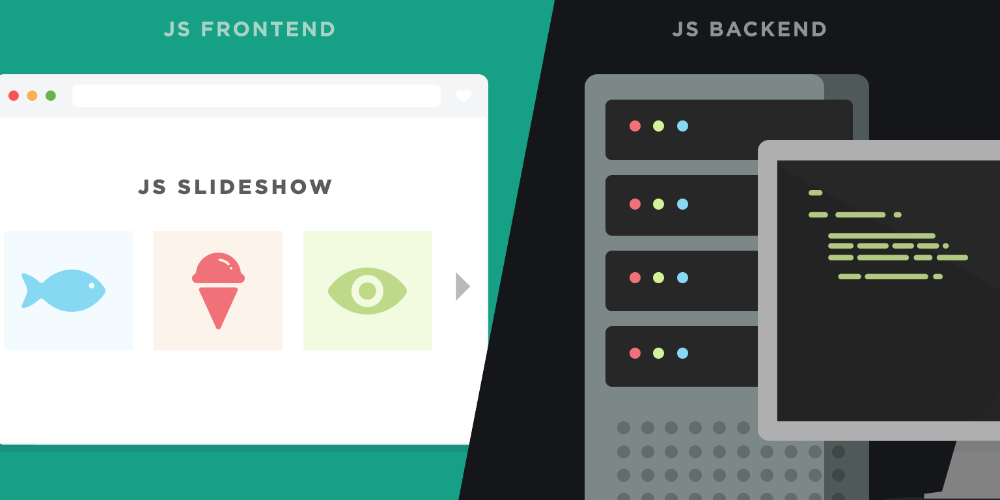
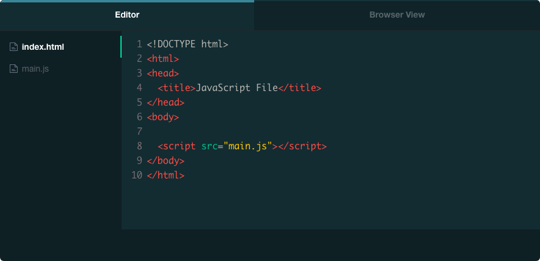
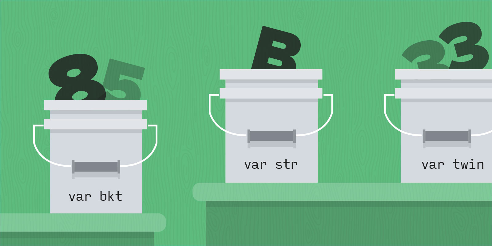
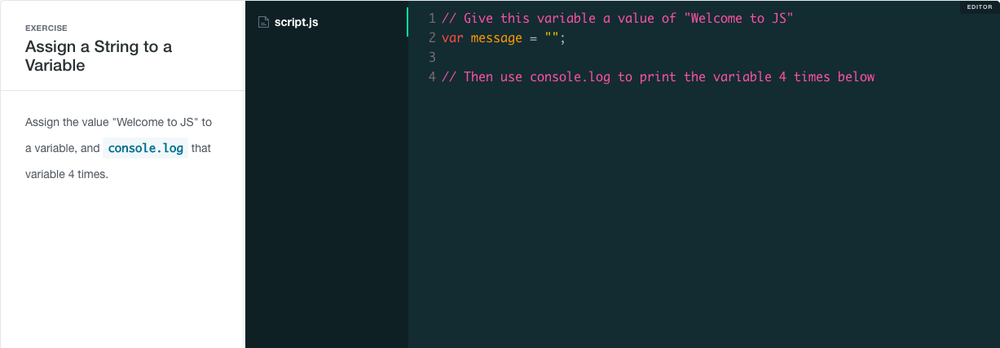

Today's class will look at the basics of the JavaScript language.

## Today's Learning Objectives

Today we'll cover these learning objectives. By the end of today, you'll be able to:

* *Identify the term 'operator'*
* *List and explain the 5 primitives in JavaScript*
* *Explain the components of an expression*
* *Identify expressions present in an existing JavaScript program*
* *Appropriately use:*
    * *Assignment*
    * *Equality*
    * *Concatenation*
    * *Math (add, subtract, multiply, divide)*
* *Convert logical statements into algorithms using 'if' and 'if else' statements*
* *Read and interpret common runtime errors in the console*
* *Use “console.log” to help develop and debug the state of a program*

As you attend the lecture and lab, read these notes, and work on your homework, keep these learning objectives top of mind. If you're having difficulty with any of the objectives, make sure to ask questions.

## What is JavaScript

JavaScript is an expressive programming language that powers a tremendous amount of the interactivity on the web, and increasingly powers servers behind the scenes. When you post an update to Facebook or Twitter, JavaScript makes it possible for the update to appear instantly, without having to refresh the page. Ever notice a credit card payment form that instantly recognizes the type of card (Visa, MasterCard, etc.) as soon as you finish typing? That's JavaScript in action. In almost everything you're doing online, JavaScript is playing an important role in improving the interactions you experience as a user.



Before we dig into JavaScript's features and discuss what it is, let's talk about what it does. JavaScript can do amazing things in browser environments (Chrome, Internet Explorer, Safari, etc.) and is a powerful server-side language as well. JavaScript written to run in a browser is often called "front-end" programming, and server-side JavaScript is usually considered "back-end" programming.

In front-end programming, JavaScript works hand-in-hand with HTML and CSS, and for a long time, JavaScript was *only* used in the browser as a part of this powerful trio of languages.


## JS File Setup

By now you have already created both HTML and CSS files, so let's look at how you create a JavaScript file.

You start by creating a file with the extension of `.js` at the end of it. Inside your project directory, create a file called `main.js`. Once that is created, tell your HTML file that it exists and to include it on your page. You do that with the HTML script tag.
```
<script src="main.js"></script>
```
Take a look at the hosted files below to see how to setup the HTML and JS files. You'll notice that the `main.js` file is located towards the bottom of the `<body>` tag. This is considered best practice since it will load the file after the rest of the HTML document loads. There are other ways to accomplish this same thing, but this will be good for now.



## Chrome Console Tab

Now that you have your HTML and JS files created locally, open your `index.html` file in Chrome. If your files are the same as above, you will not see anything but a white page. Now open your `main.js` file in a text editor and add the following line of code.

```
console.log("Logging from the console");
```

Once you do that, save the file and refresh your HTML page in Chrome.

Now, let's open the Chrome Console. To do this, click on the **View** menu in the main menu bar and select **Developer** then select **JavaScript Console**. That will open up the JavaScript console where you should now see the words "Logging from the console" displayed.

The `console.log` is a command that will allow you to send any information to the console. This is especially useful when debugging your code. Try changing the text in quotation marks, save the change, and refresh the page.

## Variables

Variables and assignments are a natural place to introduce JS, so let's start there.

**Variables** are named "buckets" that hold data and make that data available for reuse later. A variable can hold data of any type, but for now we'll use a **string** to demonstrate.



A string is a combination of letters, numbers, and special characters, surrounded by matching quote marks (more on strings later). If a string isn't stored in a variable, it has to be retyped each time you want to use it. This can result in a lot of duplication. To solve this, JavaScript makes it easy to store information in variables using a syntax like this:
```
// declare a variable and give it a value
var age = 30;
// store another value in that same variable
age = 31;
```
Before we break down the syntax of `var` and `=`, see if you can make this exercise run correctly in the browser:



Let's break down what you're seeing:


* `var` is a **keyword** in the JavaScript language. Keywords are words that have a particular meaning to the JavaScript language. When you write `var` you are telling JavaScript to create a variable. Be aware that `var` and `"var"` are different things to JavaScript. The first is a keyword that commands JavaScript to create a variable, while the second is just a string.
* **bucket** is the name that we are giving the variable. It's not a keyword; we can define any name that we want. We could have named the variable **basket** or **shoe** or **thing**. Unless it's a special reserved word, the specific name that you choose for a variable doesn't matter. It's up to you to decide a name that makes sense.
* `=` is the assignment operator. We'll discuss operators later in the crash course, but know that the assignment operator takes the value on its right and assigns it to the variable on its left. In the above code, `=` takes the string on the right and stores it in the newly created variable on the left.
* The semicolon (`;`) at the end of the line tells JavaScript that the statement is complete. A JavaScript statement is a single, complete instruction to be executed.

Let's look at another example:


Notice that the number `1` doesn't have quotes around it. That's because it's not a string, it's a number. This also means that using the `+` will do simple addition. On line two we assign a new variable called `sum` and store the result of adding `1` to `1`. Run the code sample and make sure you understand why it prints what it does. Edit the value of `magicNumber` and re-run it.

Now give this exercise a try:

INSTRUCTOR DEMO

Let's look at the difference between variable declaration and variable assignment. Notice what happens when we assign a new value to basket:

INSTRUCTOR DEMO

basket = 2; is an example of a variable assignment. The value 2 overwrites the existing value of 1, and it is now stored in the variable basket.

What happens when we declare a variable without assigning it a value?

INSTRUCTOR DEMO

Line one of the above example shows the var keyword so we know that a variable is being created called chair, but that variable isn't being assigned anything on line one. Instead, the line is terminated with a semicolon. var chair; is an example of a variable declaration. The declaration creates the variable and gives it a name. If we don't immediately assign it a value on the same line, then JavaScript assigns it the value of undefined.

Let's take a closer look with an example:

INSTRUCTOR DEMO

Line 1: the variable favoriteAnimal is created and assigns it the value "llama".
Line 2: we console.log the value stored in favoriteAnimal. It will print llama.
Line 3: nothing happens, it's just a blank line.
Line 4: we assign a new value to the existing variable favoriteAnimal. This doesn't recreate favoriteAnimal because it already exists. It just overwrites the existing value of "llama" with the new value of "river otter".
Line 5: we console.log the value stored in favoriteAnimal again. This time it will print river otter.
Rules For Naming Variables

day-4-img-5

Earlier in this lesson, we discussed that the names of variables are entirely up to the programmer. JavaScript does impose a few restrictions for naming variables, however. Here they are:

Variable names can't...

start with a number
include spaces or hyphens
be reserved words like "return", "if", "else", "for", etc. You can find a list of reserved words in JavaScript here.
Variable names can...

contain the special characters $ and _
contain upper- and lowercase letters (note that they are case sensitive, meaning var Car is different than var car)
include digits, except as the first character
Let's try a few more exercises and make sure you're clear on all of the rules and syntax.

INSTRUCTOR DEMO

What is Type?
All data in JavaScript has what's known as a type. In programming, data types helps distinguish data that "looks" similar, and allows the language to add functionality and performance improvements based on these distinctions.

For example the number 40 can be represented with the Number type as 40 or as a String type as "40". While this may seem like a strange idea, consider this: "Apollo-11" is a string because we aren't trying to say "Apollo minus eleven". Conversely "20 - 11" could be an actual calculation, in which 20 and 11 would have a type of Number. Even here, "20 - 11" could represent a football score, in which case representing that as a String may be better.

As you work with information in any programming language, you'll want to think carefully about what types are available and which type is the best for representing your data.

Dynamic Typing
JavaScript is very forgiving when it comes to types. It allows variables to store data of any type, at any time, without doing any special work. For example:

INSTRUCTOR DEMO

This can be a big convenience, but it can also be the source of some confusion. Many languages require types to be specified on variables, function parameters, classes, and more, which can be helpful when debugging and can make the language perform much faster. JavaScript's dynamic types make it easier to learn, but does add a little additional challenge in tracking down type-related errors.

Primitive Data Types
Primitive data types are those that are fundamental to storing the simplest data, like numbers and letters. The following table shows some of the primitive data types available in the JavaScript language.

Type	Syntax
Number	1, 200, 3.14159
String	"hello there!", 'hello there!'
Boolean	true, false
Undefined	undefined


Primitive data types are called "primitive" because they are atomic pieces of data that cannot get smaller. We can't break a number up into subtypes – i.e. if we to try and split 3.14159 by the whole integer and the remaining fraction, we would still have two numbers: 3 and 0.14159. The same goes for strings; if we split "hello world" into two words, we still have two strings: "hello" and "world".
Numbers

day-4-img-6

Numbers are represented exactly the way that you might expect: as numeric digits. The mathematical operators that you learned in school work on numbers addition +, subtraction -, multiplication ASTERICK HERE, and division /.

INSTRUCTOR DEMO

Try some basic math with numbers.

INSTRUCTOR DEMO

Strings
As we've already seen, strings are data types that store words or a sequence of characters. To define a string, the characters need to be wrapped in single (') or double quotes ("). Wrapping strings is important because it allows JavaScript to distinguish the string data type from an arbitrary JavaScript command.

// A string can be any sequence of characters
"hello world"
// This is also a string, but using single quotes
'I am also a string'

// If you need to use the same kind of quote inside your string,
// use the backslash `\` to "escape" it
'It\'s great'

// ...or use another kind of quote to wrap it
"It's great"

// Here's a tricky one. This isn't a number.
// It's a string, because it's wrapped in quotes
"3"

// This, however, is actually a number
3

// This is NOT a string! Notice the lack of quotes.
// JavaScript thinks this line is a variable called `thing`
thing

INSTRUCTOR DEMO

Booleans
The Boolean type is fairly straight-forward: the values true and false are special boolean values that are neither strings nor numbers. Just about any value in JavaScript can be coerced into a boolean value of true or false (type coercion is the process of converting a data type into another data type). We'll look more at boolean values when we look at control flow, but for now, remember that true and false can be represented with booleans, which is generally better than using the strings "true" and "false".

Undefined
This can be a little hard to understand at first, but basically undefined is the absence of value.

Imagine that you bought a vase from the store and decided you wanted it to go on your mantel above your fireplace. You know that eventually you want to put something in the vase but for now you are not sure what it will be.

In JavaScript we call that undefined. It's the idea of a variable declaration that will eventually hold a value, but for now is empty. We create it because we know we'll need it, but we don't store information in it till later.

Objects
Objects are a very important part of JavaScript. Objects are collections of related data and/or functionality, and you'll often use them to model data from the real world. For instance, let's take the example of a person. A person has unique properties about her, such as name, age, and favorite color. We can represent these properties in JavaScript like so:

```
// person object
var person = {
  name: "Jenny", // name is a property
  age: 45,
  favoriteColor: "blue"
}
```

You'll notice that the object person has properties that are specified in the curly braces. You'll also see that each of those properties has a value which matches a data type from above, like string and number; however, we can also store many other data types here like functions, arrays, and even other objects. Don't worry, we'll cover this all a bit later.

When you want to access a property on an object, you use the . character, which we call the property accessor. So if you wanted to access the name of our person object, you would do so like this:

```
person.name; // "Jenny"

```

We can also use the property accessor to set a property. We can either change an existing property or we can add new ones.

```
person.age = 46 // Looks like Jenny had a birthday
person.pet = "goldfish" // Jenny just bought a goldfish
```

Math Operators
Numbers and Order of Operations

day-4-img-7

The order of operations will matter for calculations, so if you need to execute one operation before another, you should wrap parentheses around it (e.g. (4 + 5) * 3). Operations will be performed in the order of "Parentheses, Exponents, Multiplication, Division, Addition, Subtraction". It can be helpful to remember this order with the phrase "Please Excuse My Dear Aunt Sally".

Let's see how wrapping parentheses around different pieces of an equation affects the calculation:

```
console.log(4.11 * 5.93 + -1 / 16);     // 24.3098
console.log(4.11 * 5.93 + (-1 / 16));   // 24.3098
console.log(4.11 * (5.93 + -1) / 16);   // 1.26639375
```

INSTRUCTOR DEMO

Concatenating Strings and Adding Numbers
The + operator also works on strings and allows us to combine multiple strings into one. Combining strings is called concatenation, and it is incredibly common in programming.

day-4-img-8

INSTRUCTOR DEMO

Control Flow
In just about every program, you'll need your code to make decisions about what to do based on some factor that is not currently known.

Imagine a simple guest list app written in JavaScript. The user can add names to a guest list, but there are limit spaces available. After 10 guests are added, the user can no longer add anymore names.

This would almost certainly require some logic on your part so that "if the limit has not been exceeded, add the guest, else the guest can't be added". This could also be expressed as "while the guest list is less than 10, allow users to be added".

These basic logical constructs form the basis for control flow tools in JavaScript. Let's look at each example.

Conditionals
Conditionals create "branches" in code where a single path of the branch is followed depending on a condition. Boolean values are used to determine whether that condition was met.

INSTRUCTOR DEMO

The else if and else blocks aren't required. Often you'll want to do nothing if a condition isn't met:

```
// if there are no warnings, nothing will happen
if (warnings > 0) {
  console.log('Warnings found!')
}
```

Errors
In JavaScript, there are a few different types of errors:

SyntaxError
TypeError
ReferenceError
EvalError
RangeError
URIError
The first three are the most common ones that you'll see starting out. Each error will provide a different level of feedback. You'll use these to help debug your code. To see if you have any errors, make sure to open your Chrome Console while you are developing. If you have any errors, they will show up there. If you get an error, read the details and use those details to help identify what is wrong.

day-4-img-9

In the error above, you can see that in line 3 we used lastname instead of lastName. This caused a ReferenceError since JavaScript is case sensitive.
