Today's class will dig into how the `display` and `float` properties work, and look at the ubiquitous "clearfix" hack.

## Today's Learning Objectives

Today we'll cover these **learning objectives**. By the end of today, you'll be able to:

* *explain the `display` property and how it affects an element's role in the layout*
* *explain what happens to an element when `float` is applied to it*
* *use the display properties to arrange page elements into a column layout*

As you attend the lecture and lab, read these notes, and work on your homework, keep these learning objectives top of mind. If you're having difficulty with any of the objectives, make sure to ask questions!

## The 'display' property

For people new to CSS, the `display` property can be easy to misunderstand. In fact, quite a few people end up using it for years without fully understanding how it works or when to use it. Since it's so commonly misunderstood, let's dig in.

The CSS specification states that the `display` property defines, among other things, how an HTML element participates in the parent formatting context. In other words, it defines the element's role in the layout. There are two primary roles: `block` (meaning it occupies the entire horizontal space) and `inline` (meaning it occupies a portion of the horizontal space equal to the width needed to fit the inner content).

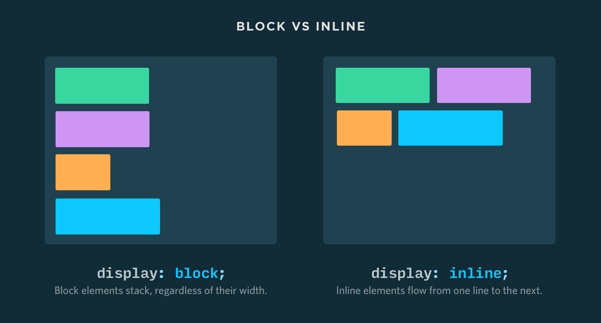

### Display Block

When using `display: block`, the element will start on a new line and occupy the full width of the parent container. You can, however, override the `width` with anything you want. Display block is the default display value for `header`, `section`, `div`, and `p` elements, as well as all header elements (`h1`, `h2`, etc). Using block means the element won't sit side by side with other elements, rather it forces other elements to a new line, either above or below itself.

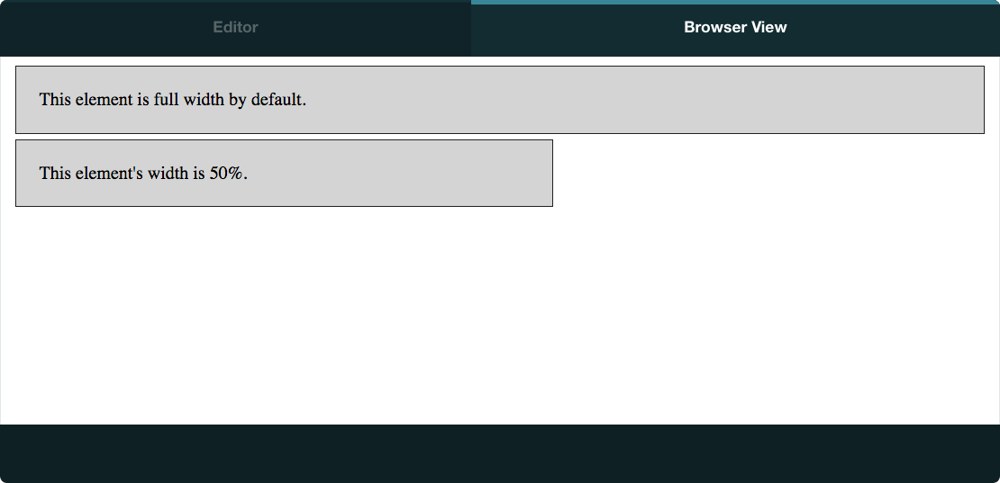

### Display Inline

When using `display: inline`, the element will occupy only the required amount of space to present all of its content. Unlike `display: block`, other content can be placed before or after it horizontally without pushing it to a new line. Inline elements however cannot have an explicitly defined `width` or `height` property. This is the default display value for elements like `span` and `a`.

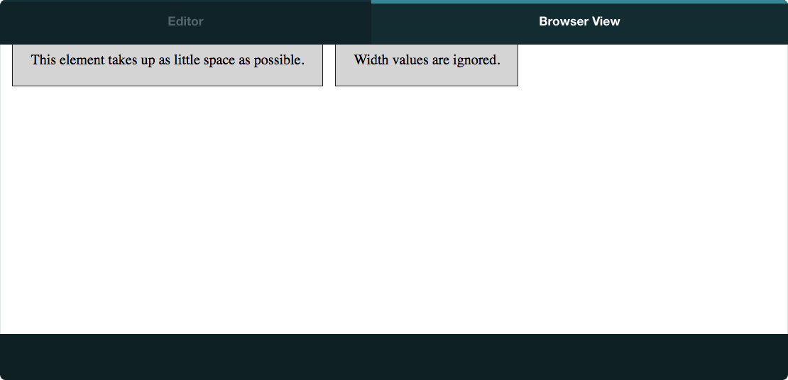

### Mixing Inline and Block Elements

It's common for web pages to contain a mixture of both block and inline elements. When this occurs, the same rules apply: `display: block`; elements will take up the full width of the parent container and sit alone in that horizontal space, even if there are `display: inline`; elements after or before it that could "fit".

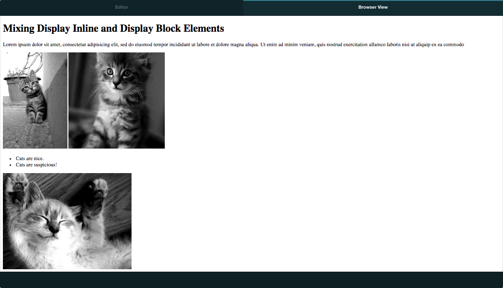

### Display Inline-Block

Now that you know about `display: block`; and `display: inline`;, you might be wondering how you could put elements next to each other horizontally and specify their width. The solution is display: `inline-block`.

The inline-block display is a useful hybrid of the block and inline display types which allows for `width` and `height` to be specified. But unlike the normal block type, inline-block allows other elements to appear before or after it horizontally. This is the default display value for elements like `button` and `select`, but it can also be applied to any other element.

If we take the inline example from above and change it to inline-block, there's a big difference in the way its rendered.

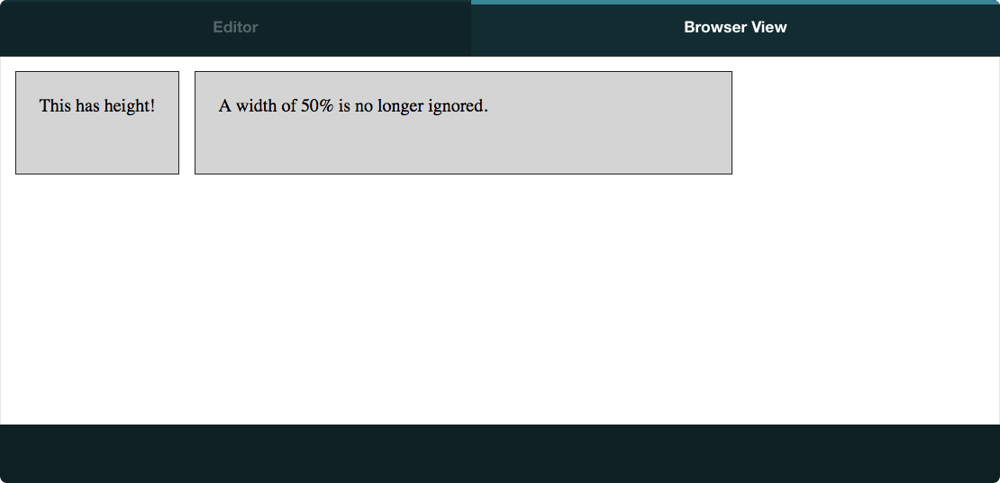


### Display None

So far we've talked about displaying elements. But what about hiding elements? When using `display: none`, the element will not be visible and will not occupy space in the layout. Note that there is also a `visibility` property that can hide elements, but those elements will still occupy space in the layout. The `display: none` property is useful in combination with JavaScript to make certain elements show or hide depending on the state of the application (hiding a menu until the "menu" button is clicked, for example). This is the default display value for elements like `script` and `meta`.

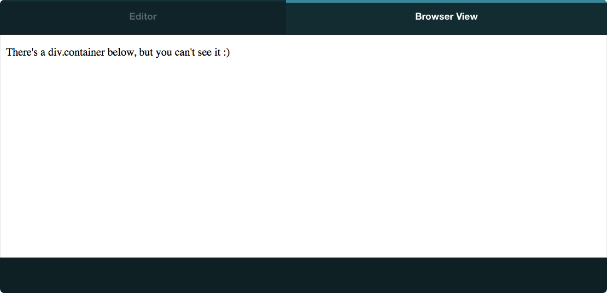

### The 'float' property

The float property describes how the browser should interpret the position of an element within the document flow. `float` is used for extracting elements from the normal flow and moving them to the left or right of other elements in their parent container. For example, wrapping text around an inline image is typically achieved by `float`'ing the HTML `img` element.

#### Float Left Or Right

To make an element move to the left, use the `float: left` property. All non-floated elements before or after will move to the right and flow around the element.

To make an element move to the right, use the `float: right` property.


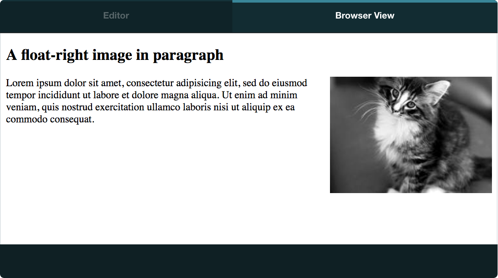

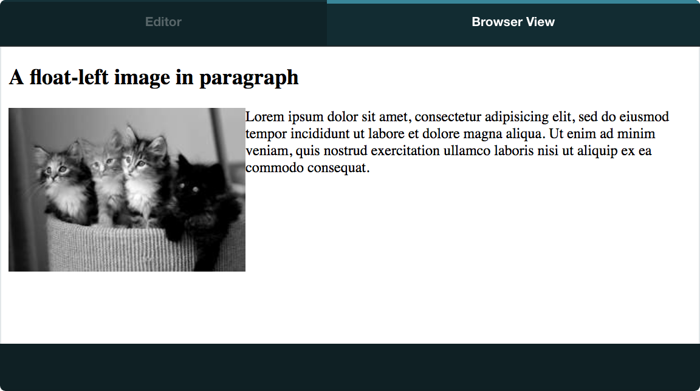

### Floats Gone Bad

Floated elements are relatively easy to manage... until you have a lot of them. If you combine the two previous examples into one, things get pretty wonky:

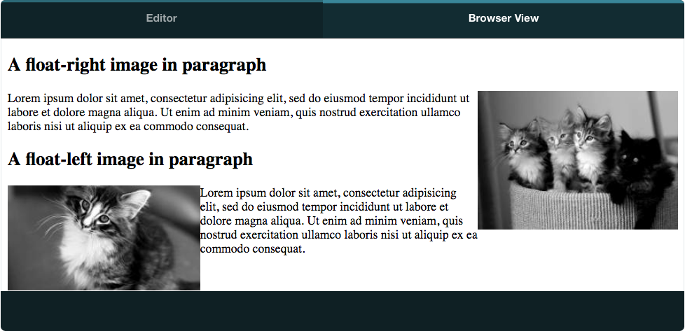

Ouch! The first image is cutting into the space of the paragraph below it! While there may be occasions where you specifically want that to happen, you'll generally find yourself trying to avoid this. Luckily, there's a property for solving this. It's called `clear`.

### Clear Left Or Right Or Both

The `clear` property is used for indicating to the browser how a particular element should position itself relative to nearby floating elements. It's used exclusively in conjunction with the `float` element above, though t usually applied to other surrounding elements.

Using `clear: left` means the element should be positioned below elements that are `float: left`. Using `clear:right` means that the element should be positioned below elements that are `float: right`. You can also specify `clear: both`, which causes the element to positioned below either type of float.

In the previous example, we say that the `<h2>` elements are `clear: both`;. Effectively, we're stating that the `<h2>` must start below the bottom of the preceding floated elements.

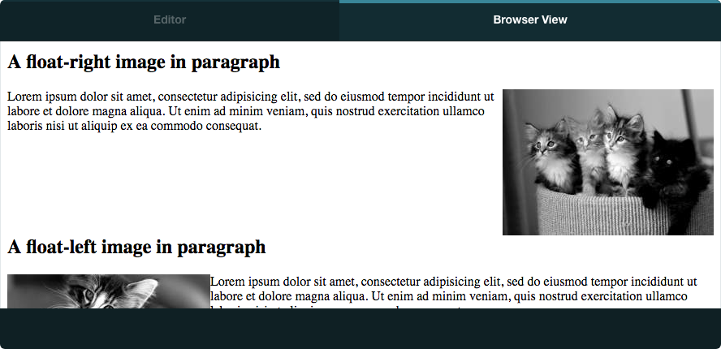

### The Clearfix Hack

Floats do have one weird side effect that you should be aware of. Sometimes parent elements can be shorter than the element inside that is floating. This causes the taller floated element to protrude from the parent element.

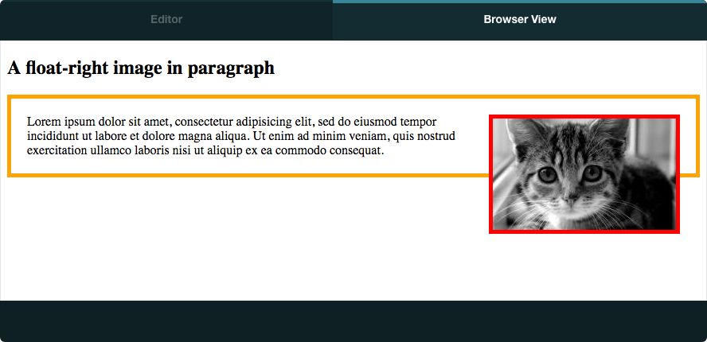

Whoops! If you have a background or border on the parent element, this can look pretty bad. You can fix this problem by using the widely used `clearfix hack`.

```
.clearfix {
  overflow: auto;
  zoom: 1;
}
```

Applying the `clearfix` class to the parent container now looks like this:

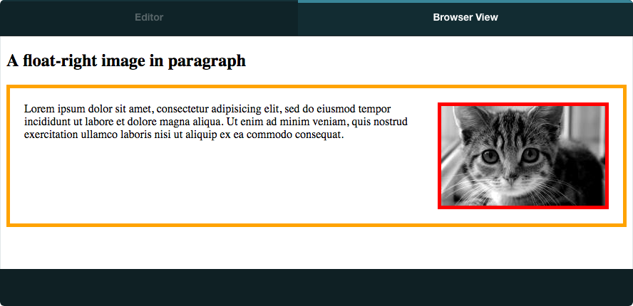


