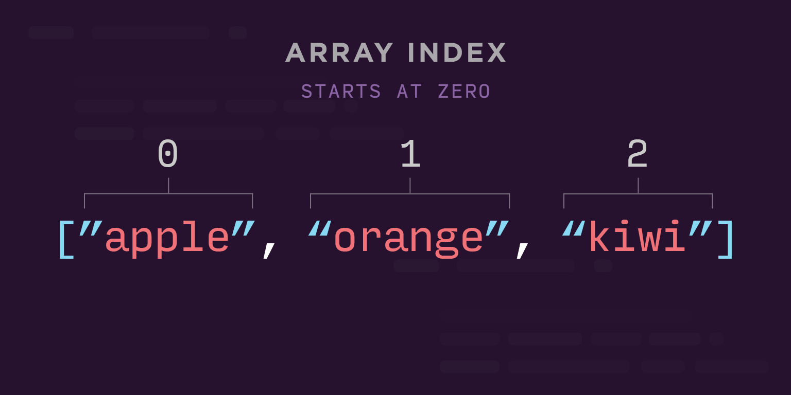
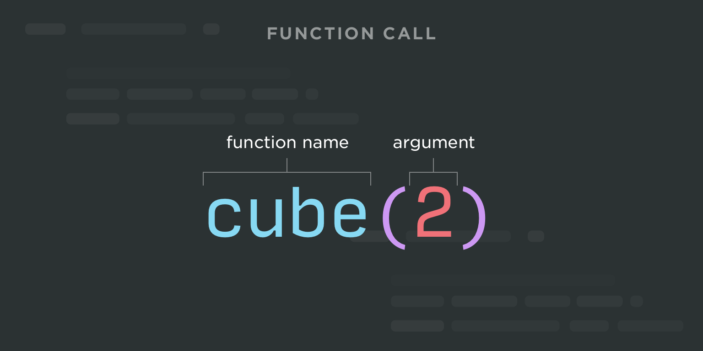
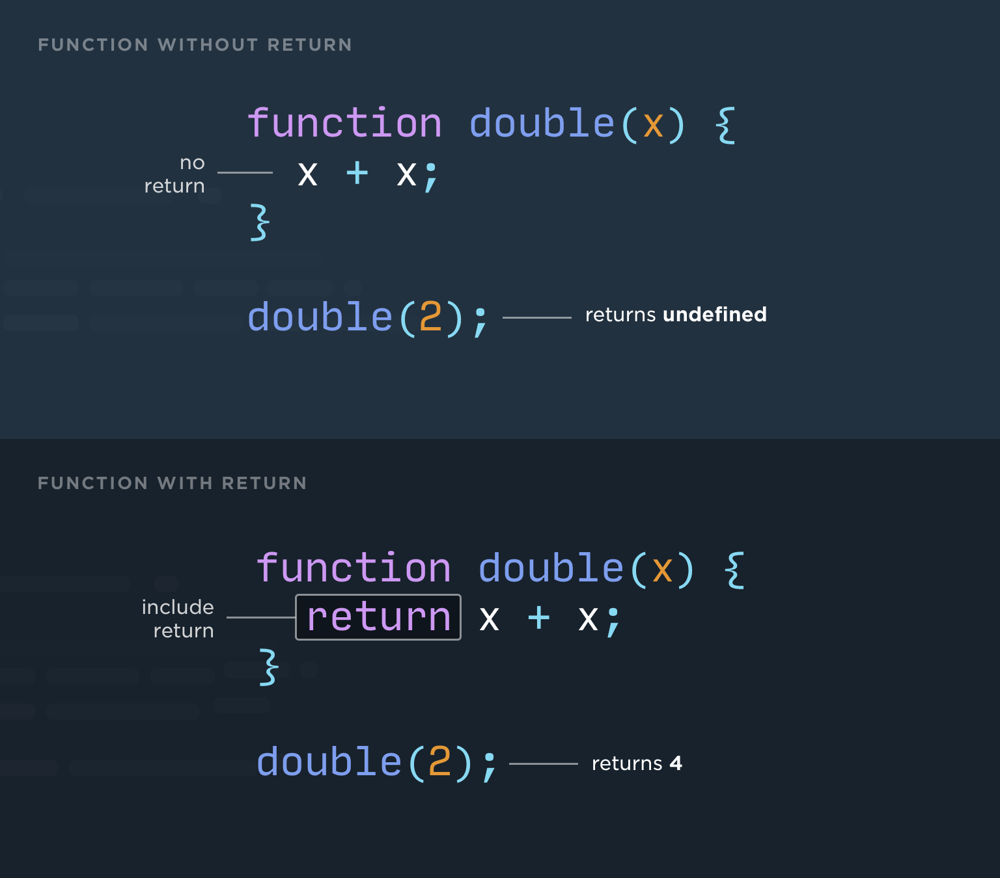

Today's class will cover three of the hardest-working tools in JavaScript: objects, arrays, and functions.

## Today's Learning Objectives

Today we'll cover these **learning objectives**. By the end of today, you'll be able to:

* identify and create object literals
* access and edit object literal data using dot notation
* explain the phrase “zero indexed”
* call existing functions that take parameters and return values to alter the state of a program

As you attend the lecture and lab, read these notes, and work on your homework, keep these learning objectives top of mind. If you're having difficulty with any of the objectives, make sure to ask questions.

## Objects in JavaScript

Often in programming, a need arises to represent some complex thing or idea in data. All of the types we've covered so far play important roles in doing this, but no type we've previously encountered gives us way to combine data in a way that feels natural.

For example, notice how clunky this code feels:
```
var dogName = "Fluffy";
var dogAge = 8;
var dogColor = "brown"
```
This is cumbersome, and gets even worse if we have multiple dogs. Luckily, JavaScript has a type known as an **object**, that allows us to store nested data of any type, including repeatable actions known as methods, which we'll discuss momentarily.
```
// create an 'object literal'
var dog = {};

// assign properties
dog.name = "Fluffly";
dog.age = 8;
dog.color = "brown";

// and access the properties later
console.log(dog.name)
```
Using the "object-dot-property" notation (i.e. `dog.age`), you can get the property's value, or set the property's value using `=`.

If you know the properties you'd like to set ahead of time, you can even write them directly in the **object literal**, which is a fancy term for an object created using the **curly braces** (`{}`).
```
// create an 'object literal'
var dog = {
  // assign properties inside the object literal
  name: "Fluffly",
  age: 8,
  color: "brown"
};

// and access the properties the same as before
console.log(dog.name)
```
There are a few *really* important differences between these two ways of setting object properties. When done inside the curly braces, you don't use the "object-dot-property" syntax. Instead, you use "property-colon-value-comma" syntax. This can be quite confusing at first, since flow-control sections are also wrapped in curly braces (and as you'll see, so are function bodies).

The second distinction is that inside an object literal, you can't write any code you feel like. See what sort of error this generates:
```
// this will create quite an error!
var someExcitingCake = {
  flavor: "chocolate lime",
  price: 20,
  console.log('wow this is going to generate an error!');
  frosting: "vanilla"
}
```
Notice that the stack trace is complaining about the `console.log`. Until you learn about functions and methods, bear in mind that an object literal should only contain **properties** and their **values**.

## Object Properties with Square Brackets

There's an additional way to get and set a property of an object; using **square brackets** (`[]`), you can provide a property name as a string. To reprise the previous examples:
```
// create an 'object literal'
var dog = {};

// assign properties
dog["name"] = "Fluffly";
dog["age"] = 8;
dog["color"] = "brown";

// and access the properties later
console.log(dog["name"])
```
This is a little more difficult to type that the "object-dot-property" syntax, but you can do something unique with this style. If you have a variable *containing* a string (or anything else that evaluates to a string), placing it between the brackets allows you to perform a dynamic lookup of a property's value.
```
var propertyToLookUp = "price"

var someExcitingCake = {
  flavor: "chocolate lime",
  price: 20,
  frosting: "vanilla"
}

console.log( someExcitingCake[propertyToLookUp] );
```
Again, as you'll see immediately in the section below, this can be slightly confusing, because arrays use a very similar syntax both for the array literal and for array indexing.

MISSING IMAGE

## Arrays
The **array** is one of the most useful and ubiquitous data types in JavaScript. Arrays are simple lists that contain zero or more objects, and can house any data type (even more arrays!). To get an idea of array syntax, let's look first at an empty array.
```
var list = [];
```
An empty array contains no data and is created here by the empty set of **square brackets**(`[` and `]`). An array with more than zero values would use the same brackets and separate each value with a comma like this:
```
var numbers = [1, 2, 42, 100];
```
You can mix data types together in a single array:
```
// numbers and strings
[0.9, "hi!", 56, "there!"];
// even arrays of arrays
[[1,2], [3,4], [5,6]];
```
And you can check the **length** by checking the `length` property. Try running these examples:
```
// Adding `.length` to the end of array
console.log([99, 100, 101].length);

// Adding `.length` on to a variable that contains
// an array works, too. Cool!
var letters = ["a", "b", "c"];
console.log(letters.length);
```
Now you try:

MISSING IMAGE

### Arrays Are Lists

Imagine that you are working on a program and need to store a list of names. We have been given a spreadsheet of names for our program to use. Without using arrays, we could store each item of data individually in our program using a series of variables.
```
// Without an array, each name might have a unique variable
var a = "Alejandra";
var b = "Jesse";
var c = "Jessica";
var d = "Tamar";
```
Assigning each name to a different variable does what we need it to, but it's cumbersome to work with. Variables need unique names or they will overwrite one another, so every string that we want to store will need its own unique variable.

What if we need to store thousands of names in our program and then do something with all of them, one by one? To access each string, we'd need to know the variables that hold every single one of them. If we want the string `"Alejandra"`, we'd have to know about the variable `a`. For `"Jessica"`, we'd have to know it's in `c`. If we wanted to store hundreds of strings, we'd need hundreds of unique variables.

Arrays provide a better way to work with lists. Since arrays *hold lists of data*, all of the names from the above example can be stored in one variable instead of many:
```
// Each value in an array is separated by a comma
var names = ["Alejandra", "Jesse", "Jessica", "Tamar"];
```

MISSING IMAGE X'2

In the previous examples, we looked at arrays that hold only five or six items, but in many programs, arrays might contain hundreds or thousands of items. For now, we'll keep things simple, so you won't be faced with complex data structures. We are just going to scratch the surface of what arrays can do.

### Accessing Data Stored in an Array

Storing data in arrays is straightforward, but getting data from them can be a little confusing at first. See if you can understand what happens when you run this example:
```
var students = ["Alejandra", "Jesse", "Jessica", "Tamar"];
console.log(students[3]);
console.log(students[2]);
console.log(students[0]);
```
If the output was confusing, don't worry. Arrays are **zero-indexed**, which means each position in the array has a number, starting with zero on the far left and counting up from there. Part of what makes this confusing is that square brackets are also used to indicate the index you're referring to.



MISSING IMAGE X'2

## Functions

In programming, being able to reuse a group of operations on different data is a basic necessity. **Functions** are an important part of the JavaScript language that allow us to do just that. Let's look at some repetitive code first:
```
// let's multiply 8 by 2
var a =  8 * 2;

// now let's multiply 12 by 2
var b = 12 * 2;

// now let's multiply 4 by 2
var c =  4 * 2;

console.log(a);
console.log(b);
console.log(c);
```
Instead of rewriting the operation multiple times, let's write a function once and then use it with different numbers.
```
function double(a) {
  return a * 2;
}

console.log(double(8));
console.log(double(12));
console.log(double(4));
```
There's a lot going on in that last example, so let's look more in depth at the syntax and concepts.

#### Declaring a Function

When you declare functions this way, the minimum code required is the `function` keyword, a function name, parentheses `()`, and curly braces `{}`:


* The keyword `function` is used to create a function
* `square` is the name of the function being created; just like variables, functions can be named anything the programmer wants (within the same rules and restrictions that apply to variable naming)
* The parentheses, `()`, are part of the function definition; **parameters** are written between the opening and closing parenthesis; here the parameter is `x`
* The curly braces, `{` and `}`, define the **function body**; in between the opening and closing curly braces is the function body, where we list all of the code that should be run when the function is called
* The keyword `return` specifies what value the function should **return**, which may be easier to think of as specifying what the function should evaluate to. In the previous example, `double(4)` returned `16`, which meant that `console.log(double(4))` would effectively be the same as `console.log(16)`. Note that `return` isn't *required*, but without it the function will simply return `undefined`.

#### Calling a Function



You've probably noticed in some of the previous examples that after the function declaration we do something interesting using the function name. While declaring a function makes it available for use, the code inside the function body won't actually run until you **call** the function.

Check out the function declaration followed by a function call below:
```
// a function declaration
function addThree(x) {
  return x + 3;
}

// calling that same function:
// function name, followed by a pair of parentheses
// with an "argument" between the parentheses
var result = addThree(7); // returns `10`
console.log(result);
```
Calling the function looks similar to a function declaration, but there's a big difference: there's no `function` keyword and no function body. Like arrays and array indexes, JavaScript often uses similar syntax for very different purposes. This can take a little while to get used to, so make sure to read carefully.

MISSING IMAGE / UPDATES STOP HERE

FUNCTION BODY AND THE RETURN KEYWORD
Inside of the function body, you can do as much work as you need. You can declare variables, use operators, even declare and use other functions. Once you're done, use the return keyword to specify what data your function call will return. Observe:

INSTRUCTOR DEMO

In the above function declaration, we declare a variable inside doubleAndAddTax, update the value stored in result, and then return the result variable.

If we don't tell a function what to return, it returns the value undefined, which is different from the string "undefined". Skipping the return keyword can be useful if your function isn't meant to return something specific, in which case undefined is ok. Nearly all of the functions in this short course are meant to use the return keyword, however. For now, don't worry too much about undefined, except to know that if your functions are returning undefined, you probably forgot the return keyword somewhere.



Make sure you understand why the following code sample will only print undefined:

INSTRUCTOR DEMO

Let's try writing a function that concatenates two strings and returns the result. This will also require something we haven't done yet - you'll need more than one parameter. See if you can get it to work!

INSTRUCTOR DEMO

Parameters and Arguments
Parameters are variables that are only accessible inside the function and are used to represent any values that are passed in as arguments when the function is called. As we've already seen, parameters first appear inside the parentheses in a function declaration. That same parameter can then be used like a variable inside the function body as a placeholder for the actual value you use in the function call.

day-5-img-6

Notice that when we call the function, we specify a value that the parameter will be set to. Each time you call a function you have an opportunity to provide a new value to set the parameter to. This can seem a little confusing at first, so let's try a few exercises:

MULTIPLE PARAMETERS
As you've already seen in the previous exercises, JavaScript functions can accept more than one parameter (or none at all). The order of the arguments will relate directly to the order of the parameters. Additional parameters and arguments (sometimes shortened to params and args) should be separated by commas.

INSTRUCTOR DEMO

Above, the first argument is stored in the first parameter, and the pattern continues with the second and third arguments.

INSTRUCTOR DEMO

You may be curious about what happens if you don't call the function with the same number of arguments as parameters. Run the code below to find out:

INSTRUCTOR DEMO

It may surprise you that the first function call doesn't throw an error, but instead considers params b and c to have undefined as their value. This is actually quite useful, in that we can write functions that have "optional" parameters. Many functions in JavaScript accept extra arguments, but don't strictly require them. In the second example, we can see that there's also no error for providing too many arguments.

INSTRUCTOR DEMO

Global Scope
JavaScript scope is a complex topic, and we won't have time to dig deep. With that said, let's take a quick look at how scope works.

In both your browser and in Node.js, JavaScript has a global scope, which contains all of the variables that were created outside of functions, or that were created without the var keyword. In reality, this is a bit of a oversimplification, but for now this is a reasonable way to think about it.

Notice the following example, where we get an error trying to access a variable that was created inside a function:

INSTRUCTOR DEMO

There's quite a bit going on here, but notice that the twoForOneCoupon variable is available inside the function, even though that variable wasn't used as an argument. That's because functions have access to their parent scope. Notice, however, that the price variable created inside the function isn't defined outside of that function. That's because a function's scope isn't available outside of that function.

If this makes your head spin, don't worry; you're not alone. JavaScript scope can take a while to understand.
