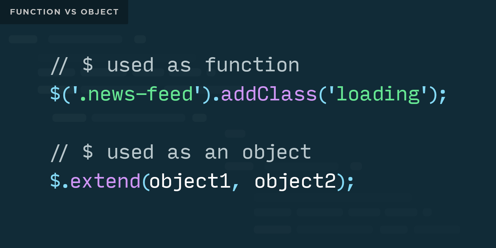

Today's class will cover jQuery, one of the most popular JavaScript tools of all time.

## Today's Learning Objectives

Today we'll cover these **learning objectives**. By the end of today, you'll be able to:

* *explain the terms 'DOM' and 'Node'*
* *explain how the Document Object Model maps to HTML*
* *explain how the Window object is connected to all JavaScript objects in an active web page*
* *use jQuery to select elements of a page*
* *use built in jQuery functions to edit the state of existing HTML elements*

As you attend the lecture and lab, read these notes, and work on your homework, keep these learning objectives top of mind. If you're having difficulty with any of the objectives, make sure to ask questions.

## The DOM

The **Document Object Model** (DOM) is a programming interface that gives you access to a your HTML document and its elements. It's a structural representation that you can use to target and modify your HTML.

Think of it as a kind of tree. You have elements, which are inside of other elements, which are inside of more elements. Each group of nested elements forms a branch, each branch is comprised of one or more nodes, and each node is an object with properties you can manipulate.

When you open your HTML document, the rendering engine (e.g. Google Chrome) parses your document to build the tree, recognizes what each node is and creates an object that represents it. Taken altogether, this is the page you see in your browser.


While accessing the DOM via plain JavaScript is relatively easy, there are a few "gotchas" with cross-browser compatibility, especially for older browsers. To help abstract many of these problems, we'll use **jQuery** to target the DOM.

[Click for more information on Handling common JavaScript problems ](https://developer.mozilla.org/en-US/docs/Learn/Tools_and_testing/Cross_browser_testing/JavaScript)

## What is jQuery?

In short, jQuery is a utility **library** for JavaScript. "Library" is a general term for a reusable package of tools that can be loaded into an application. Some of the most common tasks in browser-based JavaScript are actually quite cumbersome to do, which is why jQuery contains a wide array of general-purpose functions.

## What's with the '$'?

All of jQuery's functions are stored as methods on a single object, which is typically available in a variable called `$`. To avoid conflicts with other libraries that may store data in the `$` variable, jQuery is also always available in a variable called `jQuery`.



jQuery is an interesting tool in that the `$` is both an object and a function. While slightly confusing, this is totally allowed in JavaScript. This explains why you'll see the `$` followed by a `.` and a method name.

## Selectors

jQuery uses CSS selector syntax to target elements in your page. The following syntax, for example, uses jQuery and a CSS-style selector to target all elements with the classname "my-class": `$('.my-class');`.

Any valid CSS selector will work with jQuery. This means that if you could use that selector to style an element on your page, you could use an identical selector in jQuery to "select" those exact same elements:
```
.introduction h2 {  
    // this would affect all h2 elements found
    // inside elements with the class 'introduction'
}
```
```
// this would select all the same h2 elements
$('.introduction h2')
```
We can use any combination of selectors available to us in CSS, including nested selectors and multiple elements. Here's an example of a complex selector:
```
$('#container ul.my-todo-list li input:checked, #options input:checked');
```
The previous selector would return a collection of elements containing only checked input fields from inside both a container with an ID of `options` AND list items inside a list with the class `my-todo-list` inside a container with an ID of `container`. What a mouthful!

It's always best to simplify our selectors as much as possible, since every extra level of selection requires further processing. Instead of that big nasty selector above, it would be much better to give all the input fields we want to select a specific class, like so:
```
$('.my-input-fields:checked');
```
It's also important to remember that jQuery selectors return jQuery objects. A jQuery object is a `NodeList`, which is similar to an array but doesn't have some of the methods we expect on a plain old JavaScript array. We'll discuss a few different methods for dealing with these objects in the future, but for now, be aware that you may not be able to iterate over a jQuery collection in ways you might expect. Thankfully, jQuery provides its own versions of many of the most popular iterators, `.each()`, `.map()`, and many others.

## Adding & Removing Elements

For your web page to feel dynamic, you'll often want to add and remove elements from the page. jQuery makes it simple to do this with the `.append()` and `.prepend()` methods. `.append()` will add an item to the end of an element's content, and `.prepend()` will add it to the beginning.

Let's look at a simple example:
```
// creates an li element
var li = "<li>A dynamically generated list item!</li>"
// appends the li element to a ul element that already exists in the html
$('ul').append(li);
```
To remove an element, use the `.remove()` method. This will permanently remove an element from the page, including all its event handlers and associated data.

For more ways to add and remove elements, check out **[this primer on manipulating jQuery elements](https://learn.jquery.com/using-jquery-core/manipulating-elements/)**.

## Modifying Elements

Now that we know how to add and remove elements from our web page, the next step is to learn how to modify existing elements.

### Attributes

It's often desirable to modify an element's attributes. The most common attribute we'll want to change is the `class`. jQuery makes this easy with `.addClass()`, `.removeClass()`, and `.toggleClass()`. These do exactly what you'd expect from their names: add a new class, remove an unwanted class, or 'toggle' a class by adding it if it's not present or removing it if it is. Let's look at a simple example:
```
function flipSwitch() {
  $('#lightbulb').toggleClass('lit');
}
```
We aren't just limited to classes, though! JQuery lets us modify any attribute we want with the `.attr()` method. As is often the case in jQuery, a value is *set* by passing two arguments to a method, and you *get* a value by providing a single argument. This pattern of using the number of arguments to drastically change the behavior of a function is very common in jQuery, so it's worth making sure you're clear on the distinction.
```
var catImageUrl = $('.cat-image').attr('src');
$('.blank-image').attr('src', catImageUrl);
```
### Content

In addition to modifying elements themselves, it's also possible to modify the content of an element. We've seen `.append()`, but sometimes you'll want to entirely set the contents, or simply get all the contents. The `.html()` method will let you update the HTML content inside an element, `.text()` will set raw text (non-HTML) content, and `.val()` will set form field values.

Interestingly, these methods can also retrieve values, but unlike `.attr()`, the getter requires zero arguments. When given zero arguments they'll return the value of the element they're called on. It's also sometimes helpful to use `.empty()`, which will simply remove all HTML content from inside an element.
